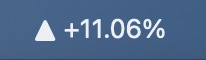
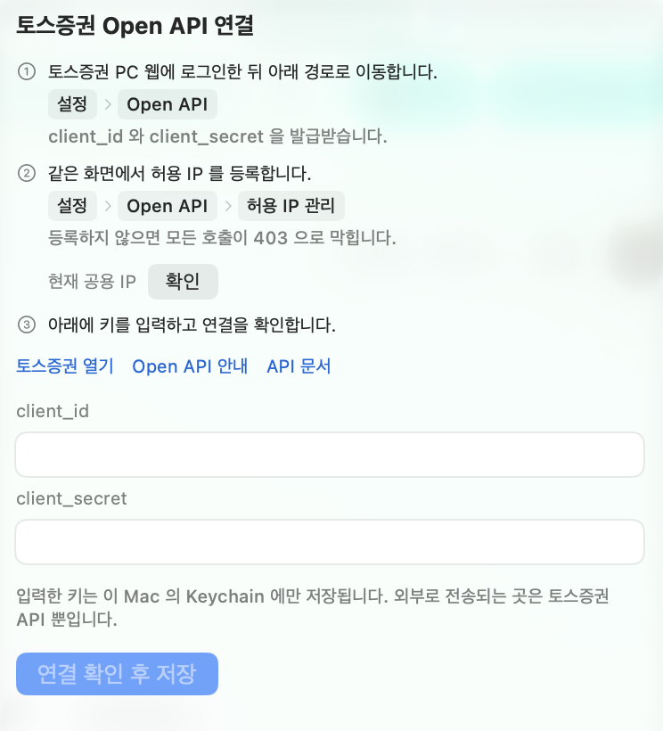
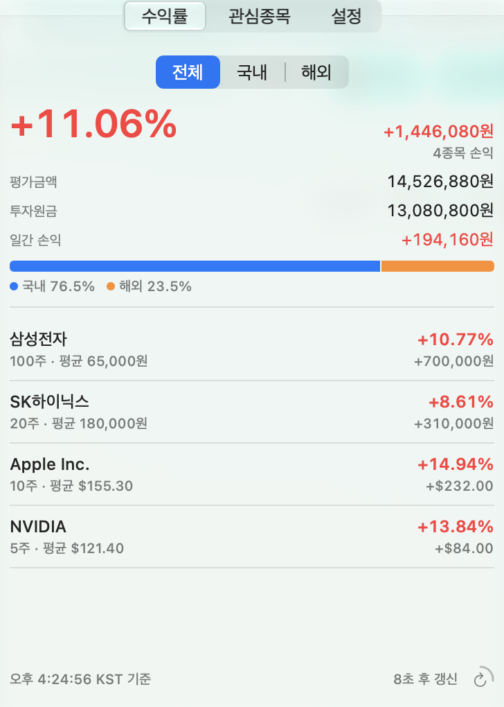
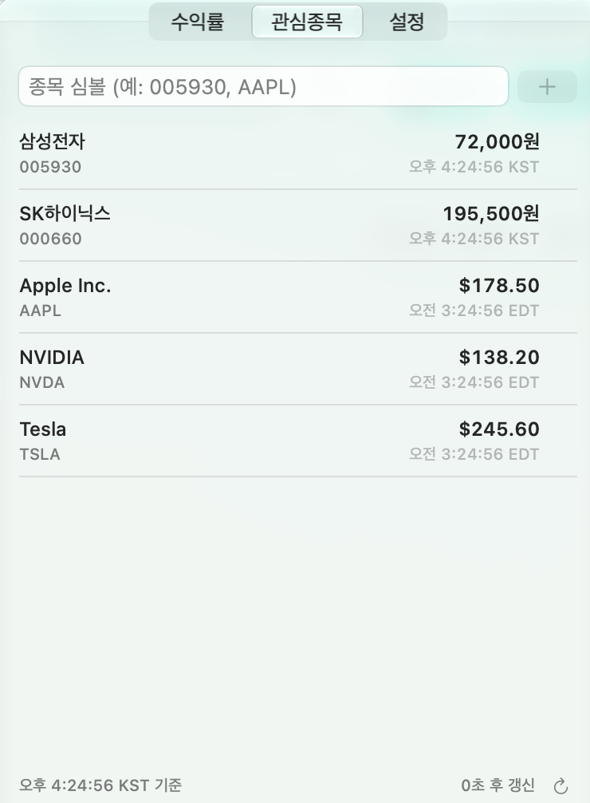
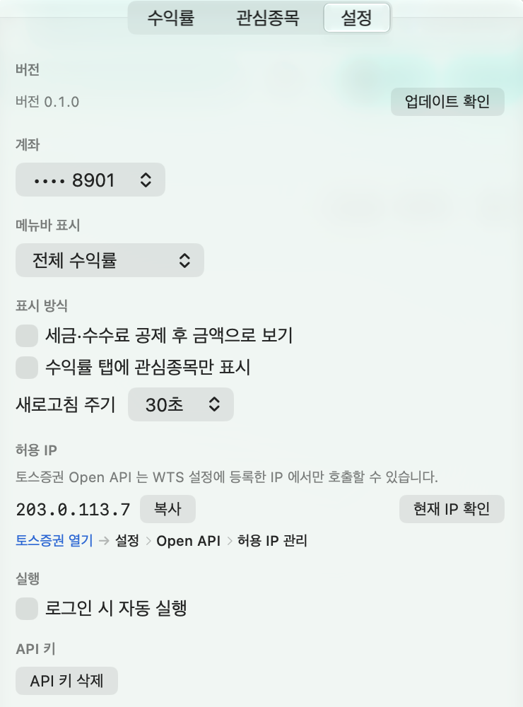
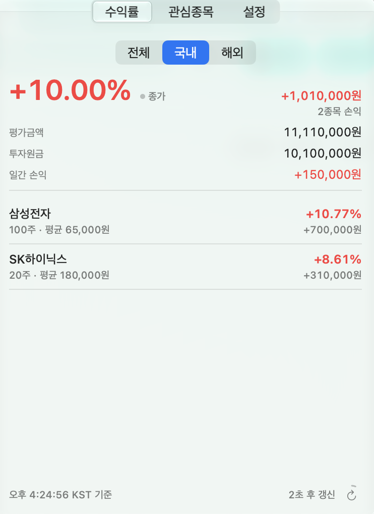
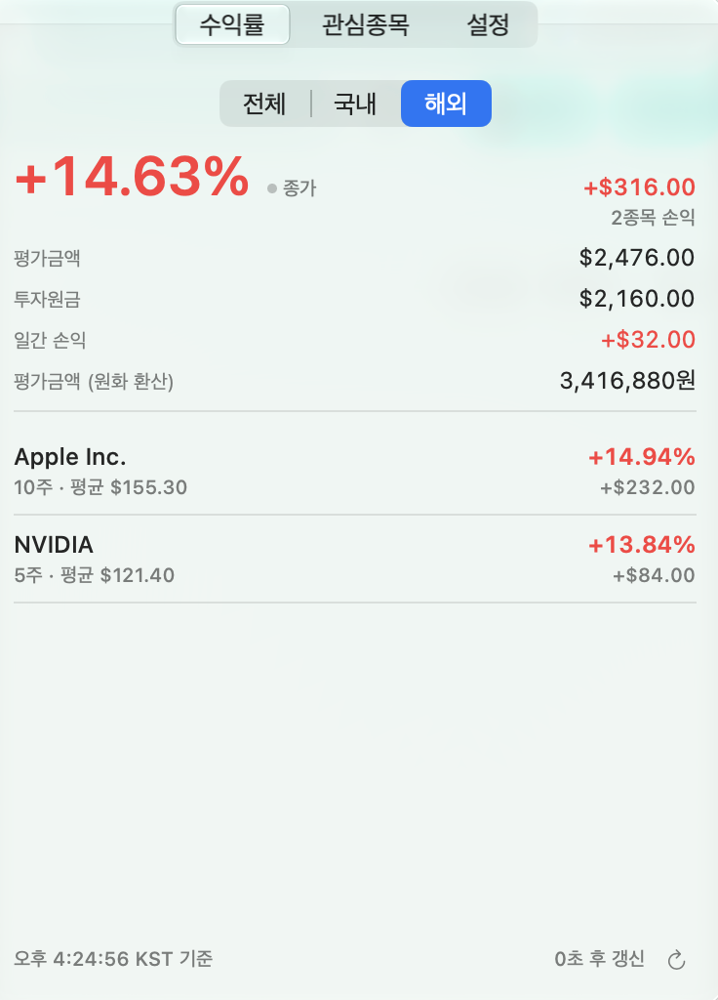
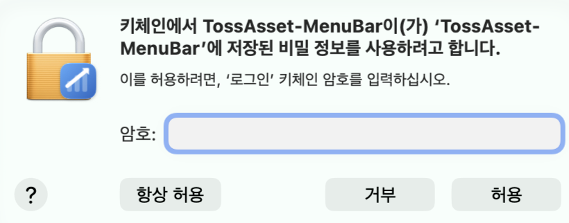

#  TossAsset-MenuBar

토스증권 Open API 로 보유 주식 수익률을 macOS 메뉴바에서 보는 앱입니다.



**조회 전용입니다.** 주문·조건주문 API 는 구현하지 않았습니다.

## 설치

```bash
curl -fsSL https://raw.githubusercontent.com/nowjiin/TossAsset-MenuBar/main/Scripts/install.sh | bash
```

- macOS 14 (Sonoma) 이상, **Apple Silicon 전용**
- 릴리스 ZIP 의 SHA-256 과 코드 서명을 검증한 뒤 `/Applications` 에 설치합니다
  (권한이 없으면 `~/Applications`)

## 첫 실행



1. 토스증권 PC 웹 → **설정 → Open API** 에서 `client_id` / `client_secret` 발급
2. 같은 화면 **허용 IP 관리** 에 이 Mac 의 공용 IP 등록
3. 앱 첫 화면에 키 입력 → `연결 확인 후 저장`

허용 IP 를 등록하지 않으면 모든 호출이 403 으로 막힙니다.
등록할 IP 는 2단계 자리에서 바로 확인·복사할 수 있습니다.

<br clear="right">


키는 이 Mac 의 **Keychain 에만** 저장하고, 액세스 토큰은 메모리에만 둡니다.

## 기능

<p>
  
  
  
</p>

| 탭 | 내용 |
|---|---|
| 수익률 | `전체 / 국내 / 해외` 세그먼트. 권역별 수익률·평가금액·투자원금·일간 손익 + 보유 종목 목록 |
| 관심종목 | 등록한 심볼의 현재가 (보유 여부 무관) |
| 설정 | 버전·업데이트 확인, 계좌 선택, 메뉴바 표시 항목, 새로고침 주기, 허용 IP 안내 |

- 메뉴바에는 전체 수익률·전체 손익금액·특정 종목 가격·특정 종목 수익률 중 하나를 띄웁니다
- 시각은 KST 기준이며, 해외 종목은 미국 동부 현지 시간으로 보여줍니다

### 권역별로 나눠 보기

세그먼트를 고르면 요약과 종목 목록이 함께 그 권역으로 좁혀집니다.
국내는 원, 해외는 달러 기준이고, 해외에는 원화 환산 평가금액을 한 줄 더 붙입니다.

<p>
  
  
</p>

개장 시간이 달라서 세그먼트별로 `현재가`/`종가` 를 구분해 표시합니다 —
값이 지금 움직이는 것인지, 마지막 종가인지 알 수 있습니다.

## 개발

```bash
./Scripts/build-app.sh          # build/TossAsset-MenuBar.app
swift run TossAssetMenuBarCheck # 검증 213건
./Scripts/make-icon.swift       # 아이콘 재생성 (디자인 변경 시에만)
```

Swift 6 툴체인이 필요합니다. Xcode 없이 Command Line Tools 만으로도 빌드됩니다.

```
Sources/
├── TossAssetMenuBarCore/   UI 에 의존하지 않는 로직 (모델·네트워킹·집계·포맷·업데이트)
├── TossAssetMenuBar/       SwiftUI 메뉴바 앱 (App/MenuBar/Portfolio/Watchlist/Settings/…)
└── TossAssetMenuBarCheck/  검증 러너
```

로직을 `Core` 로 분리한 이유는 **검증 가능성**입니다. SwiftUI 를 import 하지 않으므로 검증
러너가 앱을 실행하지 않고 그대로 호출합니다. `XCTest` 와 swift-testing 매크로는 Xcode.app
안에만 있어서, 검증 러너는 일반 실행 파일로 만들었습니다.

주요 설계 판단은 해당 코드의 주석에 남겨두었습니다.

## 배포

`main` 대상 PR 에 아래 라벨 중 하나를 붙이면, 병합 시 워크플로가 빌드·서명·릴리스까지 처리합니다.

| 라벨 | 다음 버전 |
|---|---|
| `release:major` | `1.4.2` → `2.0.0` |
| `release:minor` | `1.4.2` → `1.5.0` |
| `release:patch` | `1.4.2` → `1.4.3` |
| `release:none` | 릴리스하지 않음 |

첫 릴리스는 **Actions → Release → Run workflow** 에서 `initial` 을 선택하면 `v0.1.0` 이 됩니다.

`.github/release-notes/v<버전>.md` 가 있으면 릴리스 본문으로 쓰고, 없으면 자동 생성합니다.
로컬에서 ZIP 만 만들려면 `./Scripts/package-release.sh` 입니다.

## 알아두실 점

**서명** — 유료 Apple Developer Program 없이 배포하므로 **ad-hoc 서명**이며 Apple notarization 을
받지 않았습니다. 설치 스크립트가 SHA-256 을 검증한 뒤 다운로드 격리 속성을 제거합니다. ad-hoc
서명은 파일이 변조되지 않았음은 보장하지만 배포자의 Apple 신원은 증명하지 않습니다.

**업데이트 후 Keychain 프롬프트** — 새 버전은 코드 서명 해시가 달라 macOS 가 다른 앱으로
인식합니다. 저장된 키를 쓰기 위해 Keychain 접근을 한 번 허용해 주세요.



**Homebrew 미지원** — Homebrew 는 설치한 앱에 격리 속성을 붙이므로, notarization 없이는 첫 실행이
Gatekeeper 에 막힙니다.

## 제약

- 실시간 스트리밍 API 가 없어 폴링합니다(기본 30초). 국내·미국 장이 모두 닫히면 폴링을 멈추고
  팝오버를 열 때 갱신합니다
- 종목 이름 검색 API 가 없어 관심종목은 심볼을 직접 입력합니다 (`005930`, `AAPL`)
- Intel Mac 미지원. universal binary 로 빌드하면 지원할 수 있습니다

## 문제가 생기면

```bash
log stream --predicate 'subsystem == "TossAsset-MenuBar"' --level info
```

비밀값은 로그에 남기지 않습니다.
